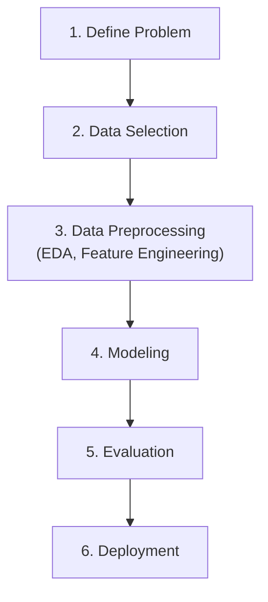

# Hướng dẫn Chi tiết Quy trình Học máy (ML Flow Guide)

## Sơ đồ Quy trình tổng quan

---

## EXPLORATORY DATA ANALYSIS (EDA) - KHÁM PHÁ DỮ LIỆU

## Bước 1. Tổng Quan Dữ Liệu & Kiểu Dữ Liệu (Data Overview & Data Types)
### Các nội dung chi tiết:
*   **Xác định kích thước dữ liệu**
*   **Xem trước định dạng và kiểu dữ liệu mẫu** 
*   **Why** Để hiểu quy mô của bộ dữ liệu và định dạng của các cột nhằm chọn phương án xử lý thích hợp. Phát hiện các trường hợp định dạng sai (ví dụ: cột ngày tháng hoặc cột số bị lưu thành chuỗi văn bản do chứa ký tự lạ).
---
## Bước 2. Thống Kê Tổng Hợp (Summary Statistics)
### Các nội dung chi tiết:
*   **Đối với thuộc tính số (Numerical Features):**
    *   Tính toán xu hướng trung tâm: Trung bình (Mean), trung vị (Median / Percentile 50%) và yếu vị (Mode).
    *   Đo lường mức độ phân tán: Độ lệch chuẩn (Standard Deviation), giá trị lớn nhất (Max), nhỏ nhất (Min) và các mức phân vị (25%, 75%).
*   **Đối với thuộc tính phân loại (Categorical Features):**
    *   Đếm số lượng giá trị duy nhất (Unique values) trong từng cột.
    *   Xác định tần suất xuất hiện và tỷ lệ phần trăm của từng nhóm phân loại (nhãn xuất hiện nhiều nhất - Mode).
*   **Why** Để hiểu nhanh các giá trị trung bình, trung vị, giá trị lớn nhất, nhỏ nhất, độ lệch chuẩn của dữ liệu mà chưa cần vẽ biểu đồ, giúp phát hiện sớm các bất thường cực đoan hoặc các giá trị không hợp lý về mặt logic.
## Bước 3. Phân Tích Đơn Biến & Phân Phối (Univariate Analysis & Distributions)
### Các nội dung chi tiết:
*   **Phân tích biến số (Data Distribution):**
    *   Đánh giá hình dạng phân phối (phân phối chuẩn - Normal Distribution, phân phối lệch trái/phải - Skewed Distribution, phân phối nhiều đỉnh).
    *   Xác định độ tập trung của dữ liệu và khoanh vùng sơ bộ các khoảng giá trị bất thường.
*   **Phân tích biến phân loại (Class Distribution):**
    *   Xem xét mức độ phân bố của các nhãn.
    *   Kiểm tra tính cân bằng của dữ liệu (đặc biệt quan trọng đối với biến mục tiêu - target trong bài toán phân loại để phát hiện mất cân bằng nhãn - Imbalanced Class).
## Bước 4. Phân Tích Song Biến & Tương Quan (Bivariate Analysis, Correlation & Patterns)
### Các nội dung chi tiết:
*   **Mối quan hệ Số - Số (Numerical vs Numerical):**
    *   Xem xét xu hướng tương quan (tuyến tính, phi tuyến, cùng chiều hay ngược chiều).
    *   Đo lường mức độ tương quan tuyến tính thông qua các hệ số tương quan (Pearson, Spearman).
*   **Mối quan hệ Số - Phân loại (Numerical vs Categorical):**
    *   So sánh sự khác biệt về phân phối (trung bình, trung vị, độ phân tán) của biến số giữa các nhóm phân loại khác nhau.
*   **Mối quan hệ Phân loại - Phân loại (Categorical vs Categorical):**
    *   Phân tích tỷ lệ phân bố chéo giữa các thuộc tính phân loại để tìm quy luật kết hợp.
*   **Patterns (Các mẫu dữ liệu):** Nhận diện các quy luật biến động đặc biệt, xu hướng (trend)
*   **What** Khảo sát mối quan hệ giữa cặp hai biến với nhau (đặc biệt là giữa các biến độc lập với biến mục tiêu) để tìm quy luật và hệ số tương quan.
*   **Why** Để lọc ra những thuộc tính có mối liên kết chặt chẽ với biến mục tiêu và nhận diện các biến độc lập bị tương quan quá mạnh với nhau gây nhiễu (đa cộng tuyến - 1 tphan đổi thì tphan kia đổi theo).
## Bước 5. Nhận Diện Dữ Liệu Thiếu, Trùng Lặp & Ngoại Lệ (Missing Data, Duplicate Data & Outliers)
### Các nội dung chi tiết:
*   **Nhận diện dữ liệu thiếu (Missing Data):** Tính toán số lượng và tỷ lệ % dữ liệu bị khuyết thiếu ở mỗi thuộc tính, phân tích xem dữ liệu bị thiếu ngẫu nhiên hay có hệ thống.
*   **Nhận diện dữ liệu trùng lặp (Duplicate Data):** Kiểm tra xem có tồn tại các dòng bản ghi giống nhau hoàn toàn hay trùng lặp khóa chính trong dataset để tránh gây nhiễu cho mô hình học máy.
*   **Nhận diện dữ liệu ngoại lệ (Outliers):** 
    *   Sử dụng khoảng giá trị IQR để xác định các điểm dữ liệu nằm ngoài biên trên và biên dưới ($Q1 - 1.5 \times IQR$ và $Q3 + 1.5 \times IQR$).
    *   Sử dụng phương pháp độ lệch chuẩn (Z-score) để tìm các điểm dữ liệu có giá trị biến động quá xa so với giá trị trung bình ($|Z-score| > 3$).
*   **Why** Để phát hiện các lỗi về chất lượng dữ liệu, đánh giá mức độ nghiêm trọng của chúng và khoanh vùng các thuộc tính cần làm sạch trước khi đưa vào huấn luyện mô hình.
## Bước 7. Đánh Giá Chất Lượng Dữ Liệu & Trực Quan Hóa (Data Quality & Data Visualization)
### Các nội dung chi tiết:
*   **Data Visualization (Trực quan hóa):** Tổng hợp việc sử dụng biểu đồ trực quan (như Box plot, Scatter plot, Bar chart) để hiển thị cấu trúc dữ liệu một cách trực quan, giúp dễ dàng giải thích kết quả EDA cho các bên liên quan.
*   **Data Quality (Đánh giá chất lượng):** Đánh giá độ sạch, độ bao phủ và tính nhất quán của bộ dữ liệu thô để kết luận xem dữ liệu đã sẵn sàng cho bước huấn luyện mô hình hay chưa.
*   **Why** Để có bức tranh tổng thể cuối cùng về độ sạch của dữ liệu, từ đó đưa ra quyết định xem dữ liệu đã đủ điều kiện huấn luyện mô hình chưa và lên kế hoạch cụ thể cho các bước biến đổi dữ liệu tiếp theo.

---

## FEATURE ENGINEERING - KỸ NGHỆ ĐẶC TRƯNG & TIỀN XỬ LÝ

## 1. Data Cleaning
### Các nội dung chi tiết:
*   **Xóa bỏ dữ liệu Duplicate**
*   **Thêm biến hoặc thêm biến chỉ thị khuyết thiếu (Missing Indicator)** 
*   **Why:** Phần lớn các mô hình học máy (ngoại trừ một số thuật toán dạng cây như XGBoost, LightGBM) không thể hoạt động hoặc sẽ báo lỗi nếu đầu vào chứa giá trị khuyết thiếu.
## 2. Xử Lý Giá Trị Ngoại Lệ (Handling Outliers) và Cleantext
### Các nội dung chi tiết:
*   **Cắt tỉa (Trimming):** Loại bỏ hoàn toàn các hàng dữ liệu chứa giá trị ngoại lệ nếu số lượng nhỏ và không làm suy giảm đáng kể kích thước tập huấn luyện.
*   **Giới hạn biên (Winsorization/Capping):** Thay thế các giá trị vượt ngoài phạm vi bình thường (thường dựa trên $1.5 \times IQR$ hoặc Z-score) bằng giá trị biên lớn nhất hoặc nhỏ nhất được chấp nhận.
*   **Biến đổi toán học (Mathematical Transformations):** Sử dụng các hàm toán học như Logarithm, Căn bậc hai (Square Root) hoặc Box-Cox để nén các giá trị cực lớn, làm giảm tác động của outliers và đưa phân phối dữ liệu về gần phân phối chuẩn.
*   **Why:** Outliers có thể làm lệch nghiêm trọng đường biên quyết định hoặc các hệ số trọng số của các mô hình nhạy cảm với khoảng cách (như Linear Regression, Logistic Regression, KNN, SVM, Mạng nơ-ron). Cleantext giúp giảm kích thước bộ từ vựng của TF-IDF và loại bỏ các nhiễu ngẫu nhiên. Ví dụ: 
## 3. Mã Hóa Biến Phân Loại (Categorical Encoding)
### Các nội dung chi tiết:
*   **Mã hóa One-Hot (One-Hot Encoding):** Chuyển đổi mỗi danh mục thành một cột nhị phân mới (0 hoặc 1). Phù hợp cho các biến không có thứ tự và số lượng danh mục ít.
*   **Mã hóa Thứ tự (Ordinal Encoding):** Gán các giá trị phân loại thành các số nguyên theo thứ tự tăng dần hoặc giảm dần dựa trên một logic thứ cấp (ví dụ: mức độ hài lòng, học vị).
*   **Mã hóa theo Biến mục tiêu (Target Encoding / Mean Encoding):** Thay thế mỗi danh mục bằng giá trị trung bình của biến mục tiêu tương ứng với danh mục đó. Thường dùng cho các biến phân loại có rất nhiều nhóm khác nhau (High Cardinality).
*   **Mã hóa theo Tần suất (Frequency Encoding):** Thay thế danh mục bằng tần suất hoặc tỷ lệ phần trăm xuất hiện của nó trong bộ dữ liệu.
*   **Why:** Mô hình học máy thực chất là các phép toán số học phức tạp, chúng chỉ hiểu và tính toán được trên các con số, không thể làm việc trực tiếp trên văn bản hay ký tự chuỗi.
## 4. Biến Đổi & Chuẩn Hóa Biến Số (Numerical Transformation & Scaling)
### Các nội dung chi tiết:
*   **Chuẩn hóa Z-Score (Standardization):** Biến đổi đặc trưng số để có giá trị trung bình bằng 0 và độ lệch chuẩn bằng 1. Thích hợp cho phần lớn các mô hình tuyến tính, SVM, hoặc mạng nơ-ron.
*   **Chuẩn hóa Min-Max (Normalization):** Đưa toàn bộ giá trị đặc trưng về một khoảng cố định (thường là từ 0 đến 1). Giúp bảo toàn các giá trị bằng 0 trong ma trận thưa thớt (sparse matrix).
*   **Chuẩn hóa Robust (Robust Scaling):** Sử dụng trung vị (Median) và khoảng phân vị (IQR) để chuẩn hóa dữ liệu, giúp hạn chế sự ảnh hưởng tiêu cực của các giá trị ngoại lệ.
*   **Why:** Tránh việc các thuộc tính có biên độ giá trị lớn (ví dụ: thu nhập hàng triệu) lấn át các thuộc tính có biên độ nhỏ (ví dụ: độ tuổi từ 1-100) trong các mô hình tính khoảng cách hoặc tối ưu hóa độ dốc gradient.
## 5. Tạo các đặc trưng siêu dữ liệu
### Các nội dung chi tiết: 
*   **(Metadata Feature Creation)**
*   **What:** Là việc tự thiết kế thêm các đặc trưng bổ trợ dựa trên hành vi viết email của người gửi như: email có chứa từ khóa lừa đảo (`has_phishing`), email có phải thư phản hồi (`is_reply`), độ dài tiêu đề (`subject_len_words`).
*   **Why:** Cung cấp cho mô hình các tín hiệu hành vi phi văn bản cực kỳ mạnh mẽ để củng cố quyết định phân loại bên cạnh các từ khóa TF-IDF.
## 6. Vector hóa văn bản
### Các nội dung chi tiết:
*   **(TF-IDF Vectorization)**
*   **What:** Là phương pháp chuyển đổi văn bản của tiêu đề và nội dung email thành các vector số học dựa trên tần suất xuất hiện của từ trong tài liệu (TF) và tần suất nghịch đảo của từ trong toàn bộ tập dữ liệu (IDF).
*   **Why:** TF-IDF giúp đánh giá tầm quan trọng của một từ khóa trong email: từ nào xuất hiện nhiều trong thư hiện tại nhưng hiếm khi xuất hiện ở thư khác sẽ được gán trọng số cao.
## 7. Lựa Chọn Đặc Trưng (Feature Selection)
### Các nội dung chi tiết:
*   **Phương pháp lọc (Filter Methods):** Đánh giá độc lập từng đặc trưng bằng các chỉ số thống kê (hệ số tương quan, kiểm định Chi-Square, ANOVA, Mutual Information) và loại bỏ những biến ít liên quan hoặc bị trùng lặp.
*   **Phương pháp bọc (Wrapper Methods):** Lựa chọn đặc trưng thông qua việc thử nghiệm huấn luyện mô hình nhiều lần và loại bỏ/thêm dần các đặc trưng (RFE - loại bỏ đặc trưng đệ quy, Forward/Backward Selection).
*   **Phương pháp nhúng (Embedded Methods):** Sử dụng các mô hình có khả năng tự đánh giá độ quan trọng của đặc trưng trong quá trình huấn luyện như hồi quy Lasso (L1 regularization), hoặc các mô hình dạng cây quyết định (Random Forest, XGBoost).
*   **What:** Quá trình đánh giá và chỉ giữ lại những đặc trưng quan trọng nhất đối với việc dự báo, loại bỏ các đặc trưng thừa hoặc gây nhiễu cho mô hình.
*   **Why:** Giảm thiểu hiện tượng quá khớp (overfitting), rút ngắn thời gian huấn luyện mô hình, tiết kiệm tài nguyên tính toán và làm cho mô hình dễ giải thích hơn đối với con người.

## BƯỚC 3: MODELING - HUẤN LUYỆN MÔ HÌNH

### Bước 1. Thiết Lập Mô Hình Cơ Sở (Baseline Model)
*   **Các nội dung chi tiết:**
    *   Lựa chọn một mô hình đơn giản hoặc một heuristic cơ bản (ví dụ: Zero-R, Hồi quy Logistic mặc định, hoặc Heuristic theo luật cứng) để thiết lập một mốc điểm chuẩn (benchmark).
    *   Huấn luyện và đo lường hiệu năng của mô hình cơ sở này trên cùng tập dữ liệu ban đầu.
*   **What (Là gì?):** Mô hình cơ sở là mô hình đơn giản nhất có thể chạy được, dùng làm thước đo chuẩn để đánh giá sự tiến bộ của các mô hình phức tạp hơn.
*   **Why (Tại sao cần làm?):** Để kiểm chứng xem việc áp dụng các mô hình học máy phức tạp, tốn tài nguyên có thực sự mang lại hiệu quả vượt trội so với các giải pháp đơn giản hoặc phỏng đoán ngẫu nhiên hay không.

### Bước 2. Lựa Chọn Thuật Toán & Huấn Luyện (Model Selection & Training)
*   **Các nội dung chi tiết:**
    *   Lựa chọn danh sách các thuật toán ứng viên phù hợp với dạng bài toán (ví dụ: bài toán phân loại nhị phân như Spam có thể dùng Logistic Regression, Naive Bayes, KNN, SVM, Random Forest, XGBoost; bài toán hồi quy dùng Linear Regression, Decision Tree).
    *   Huấn luyện các mô hình này trên tập huấn luyện (Train Set) sử dụng các thư viện hoặc tự viết thuật toán từ đầu (from scratch) để tối ưu hóa các tham số (weights, biases) thông qua hàm mất mát (Loss Function) và thuật toán tối ưu (Gradient Descent, Adam, L-BFGS).
*   **Why (Tại sao cần làm?):** Mỗi thuật toán có các giả định giả thuyết (inductive bias) khác nhau về phân phối dữ liệu. Việc thử nghiệm nhiều thuật toán giúp tìm ra mô hình khớp tốt nhất với đặc trưng của tập dữ liệu thực tế.

### Bước 3. Tinh Chỉnh Siêu Tham Số (Hyperparameter Tuning)
*   **Các nội dung chi tiết:**
    *   Xác định không gian tìm kiếm các siêu tham số (như tốc độ học `learning_rate`, số vòng lặp tối đa `n_iters`, độ sâu của cây `max_depth`, hệ số phạt regularization `lambda_`/`alpha`).
    *   Sử dụng các phương pháp tìm kiếm:
        *   **Grid Search:** Duyệt qua tất cả các tổ hợp siêu tham số có trong danh sách được định nghĩa sẵn.
        *   **Random Search:** Chọn ngẫu nhiên các tổ hợp siêu tham số từ phân phối xác suất định sẵn để tiết kiệm thời gian.
        *   **Bayesian Optimization:** Xây dựng mô hình xác suất để ước lượng tổ hợp siêu tham số tiếp theo sẽ cho kết quả tốt nhất dựa trên các lần thử trước đó.
*   **Why (Tại sao cần làm?):** Siêu tham số không được mô hình tự học trong quá trình huấn luyện mà phải được lập trình viên cấu hình trước. Việc tinh chỉnh siêu tham số tối ưu giúp mô hình đạt hiệu năng cao nhất trên tập xác thực.

### Bước 4. Kiểm Soát Quá Khớp & Điều Hòa (Regularization & Overfitting Control)
*   **Các nội dung chi tiết:**
    *   Áp dụng các kỹ thuật phạt sai số như điều hòa L1 (Lasso) để loại bỏ các đặc trưng không quan trọng (feature selection) hoặc L2 (Ridge) để thu nhỏ các hệ số trọng số lớn, ngăn chặn mô hình phụ thuộc quá mức vào một vài đặc trưng đơn lẻ.
    *   Sử dụng cơ chế dừng huấn luyện sớm (Early Stopping) đối với các mô hình tối ưu lặp hoặc mạng nơ-ron khi giá trị mất mát trên tập kiểm thử bắt đầu tăng trở lại.
*   **Why (Tại sao cần làm?):** Để đảm bảo mô hình có khả năng tổng quát hóa tốt (generalization) trên dữ liệu mới chưa từng thấy trong thực tế, thay vì chỉ ghi nhớ các nhiễu (noise) của tập huấn luyện.

---

## BƯỚC 4: EVALUATION - ĐÁNH GIÁ MÔ HÌNH

### Bước 1. Lựa Chọn Chiến Lược Phân Chia & Đánh Giá Chéo (Validation Strategies)
*   **Các nội dung chi tiết:**
    *   **K-Fold Cross-Validation:** Chia tập dữ liệu thành $K$ phần bằng nhau, huấn luyện mô hình $K$ lần trên $K-1$ phần và đánh giá trên phần còn lại, cuối cùng lấy kết quả trung bình.
    *   **Stratified K-Fold:** Giữ nguyên tỷ lệ các lớp phân loại trong mỗi phần chia (fold), đặc biệt quan trọng khi dữ liệu bị mất cân bằng lớp nghiêm trọng.
    *   **Time-Series Split:** Phân chia dữ liệu theo dòng thời gian để dữ liệu huấn luyện luôn xảy ra trước dữ liệu đánh giá, tránh hiện tượng rò rỉ dữ liệu tương lai (data leakage).
*   **Why (Tại sao cần làm?):** Đánh giá chéo giúp thu được ước lượng hiệu năng khách quan và ổn định nhất của mô hình, giảm thiểu sự thiên lệch (bias) do việc phân chia tập train/test ngẫu nhiên duy nhất gây ra.

### Bước 2. Lựa Chọn Chỉ Số Đánh Giá (Evaluation Metrics)
*   **Các nội dung chi tiết:**
    *   **Đối với bài toán Phân loại (Classification):**
        *   **Accuracy (Độ chính xác tổng quan):** Tỷ lệ dự báo đúng trên tổng số mẫu (không đáng tin cậy nếu dữ liệu mất cân bằng).
        *   **Precision (Độ chính xác dự đoán lớp dương):** Tỷ lệ mẫu thực sự dương tính trên tổng số mẫu được dự báo là dương tính (quan trọng khi hậu quả của False Positive cao, ví dụ: khóa nhầm tài khoản của người dùng hợp lệ).
        *   **Recall / Sensitivity (Độ phủ):** Tỷ lệ mẫu được dự báo dương tính chính xác trên tổng số mẫu thực sự dương tính (quan trọng khi hậu quả của False Negative cao, ví dụ: bỏ sót email chứa virus hoặc giao dịch gian lận).
        *   **F1-Score:** Trung bình điều hòa giữa Precision và Recall giúp cân bằng cả hai chỉ số này.
        *   **ROC-AUC:** Diện tích dưới đường cong ROC biểu thị khả năng phân tách giữa lớp dương tính và âm tính của mô hình tại mọi ngưỡng quyết định.
        *   **Confusion Matrix (Ma trận nhầm lẫn):** Bảng tổng hợp số lượng các mẫu True Positive (TP), True Negative (TN), False Positive (FP), và False Negative (FN).
    *   **Đối với bài toán Hồi quy (Regression):**
        *   **MSE / RMSE:** Đo lường độ lớn của các sai số dự báo, phạt nặng các sai số lớn.
        *   **MAE:** Đo sai số tuyệt đối trung bình, phản ánh sai lệch thực tế trung bình mà ít bị ảnh hưởng bởi các điểm ngoại lệ.
        *   **R-squared ($R^2$):** Tỷ lệ phương sai của biến mục tiêu được giải thích bởi mô hình so với mô hình dự báo trung bình đơn giản.
*   **Why (Tại sao cần làm?):** Chọn sai chỉ số đánh giá có thể dẫn đến việc lựa chọn một mô hình tồi (ví dụ: mô hình đạt Accuracy 99% trên dữ liệu mất cân bằng nhãn nhưng thực tế không phát hiện được bất kỳ mẫu lỗi nào).

### Bước 3. Chẩn Đoán Mô Hình & Phân Tích Sai Số (Model Diagnostics & Error Analysis)
*   **Các nội dung chi tiết:**
    *   **Đồ thị Learning Curve:** So sánh sai số huấn luyện và sai số kiểm thử theo thời gian hoặc kích thước tập dữ liệu để xác định mô hình đang bị chệch cao (Bias - Underfitting) hay phương sai cao (Variance - Overfitting).
    *   **Phân tích sai số thủ công (Error Analysis):** Lọc ra các mẫu dữ liệu dự đoán sai, phân tích tìm nguyên nhân cốt lõi (như nhãn bị gán sai trong tập dữ liệu gốc, đặc trưng bị thiếu thông tin hoặc chứa mẫu nhiễu mới).
*   **Why (Tại sao cần làm?):** Giúp nhà phát triển định hướng rõ ràng cho bước tiếp theo (cần thu thập thêm dữ liệu, thiết kế thêm đặc trưng, hay thay đổi kiến trúc thuật toán).

---

## BƯỚC 5: DEPLOYMENT - TRIỂN KHAI MÔ HÌNH

### Bước 1. Đóng Gói Mô Hình (Model Serialization & Packaging)
*   **Các nội dung chi tiết:**
    *   Lưu trữ (serialize) mô hình đã được huấn luyện tối ưu cùng với các bộ tiền xử lý liên quan (như Vectorizer, Scaler, Selector) thành các định dạng tệp tin nhị phân (như Pickle `.pkl`, Joblib `.joblib`, ONNX, PMML).
    *   Thiết lập các kiểm thử tích hợp (integration tests) để đảm bảo mô hình khi được tải lại trên môi trường sản xuất (production) trả về kết quả dự báo khớp hoàn toàn với kết quả thu được ở môi trường huấn luyện.
*   **Why (Tại sao cần làm?):** Cho phép di chuyển mô hình từ môi trường phát triển sang môi trường vận hành thực tế mà không cần huấn luyện lại từ đầu, đảm bảo tính nhất quán của kết quả dự báo.

### Bước 2. Xây Dựng Kiến Trúc Suy Luận (Inference Architecture)
*   **Các nội dung chi tiết:**
    *   **Dự báo thời gian thực (Real-time/Online Inference):** Mô hình được triển khai và gọi thông qua các API RESTful/gRPC (sử dụng FastAPI, Flask, Django) để trả lời kết quả dự báo ngay lập tức cho từng yêu cầu đơn lẻ.
    *   **Dự báo theo lô (Batch Inference):** Chạy định kỳ (hàng giờ, hàng ngày) trên một lượng lớn dữ liệu được lưu trữ sẵn trong cơ sở dữ liệu để phục vụ cho các báo cáo hoặc hệ thống phân tích không yêu cầu phản hồi tức thì.
*   **Why (Tại sao cần làm?):** Lựa chọn kiến trúc suy luận phù hợp giúp cân bằng giữa độ trễ (latency), băng thông (throughput), và chi phí tài nguyên phần cứng.

### Bước 3. Container Hóa & Đưa Lên Môi Trường Sản Xuất (Containerization & Orchestration)
*   **Các nội dung chi tiết:**
    *   Viết `Dockerfile` đóng gói mã nguồn, tệp tin mô hình, các thư viện phụ thuộc thành một Container Image để đảm bảo mô hình có thể chạy được ở mọi nơi một cách độc lập.
    *   Triển khai container lên các dịch vụ đám mây (AWS ECS, GCP Cloud Run) hoặc sử dụng các công cụ quản lý container (Kubernetes) để tự động hóa việc mở rộng quy mô (scaling) và cân bằng tải.
*   **Why (Tại sao cần làm?):** Đảm bảo tính nhất quán môi trường, tránh lỗi "chạy được trên máy tôi nhưng lỗi trên server" và giúp hệ thống dễ dàng mở rộng khi lưu lượng truy cập tăng đột biến.

### Bước 4. Giám Sát & Bảo Trì Mô Hình (Monitoring & Drift Detection)
*   **Các nội dung chi tiết:**
    *   **Giám sát Data Drift (Lệch dữ liệu):** Theo dõi sự thay đổi về mặt phân phối của dữ liệu đầu vào thực tế theo thời gian so với tập dữ liệu huấn luyện ban đầu.
    *   **Giám sát Concept Drift (Lệch khái niệm):** Theo dõi sự thay đổi trong mối quan hệ giữa biến độc lập và biến mục tiêu thực tế (ví dụ: hành vi viết thư spam thay đổi liên tục để né tránh các bộ lọc từ khóa cũ).
    *   **Cơ chế huấn luyện lại (Retraining Loop):** Thiết lập quy trình tự động thu thập dữ liệu thực tế mới, dán nhãn và huấn luyện lại mô hình định kỳ để duy trì độ chính xác.
*   **Why (Tại sao cần làm?):** Chất lượng dự đoán của hệ thống sẽ suy giảm theo thời gian do tác động của sự thay đổi hành vi người dùng thực tế. Việc giám sát và bảo trì liên tục giúp phát hiện sớm và khắc phục kịp thời hiện tượng suy giảm chất lượng này.
