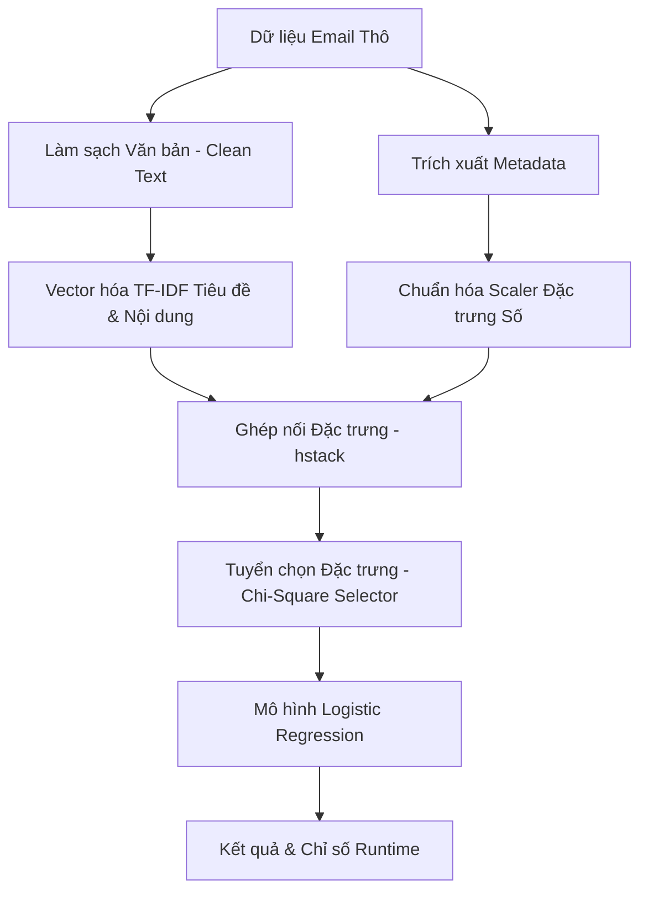

# Tài Liệu Thiết Kế & Triển Khai Hệ Thống Phân Loại Thư Rác (Email Spam Classifier Deployment Specification)

Tài liệu này đặc tả quy trình thiết kế, kiến trúc vận hành và hướng dẫn triển khai mô hình học máy phân loại Email Spam ở môi trường Runtime (thời gian chạy thực tế).

---

## 📊 1. Tổng Quan Hệ Thống (System Overview)

Hệ thống cung cấp giải pháp phân loại Email Spam/Not Spam bằng mô hình Hồi quy Logistic tự huấn luyện (Logistic Regression from Scratch), kết hợp với bộ tiền xử lý đặc trưng (TF-IDF và Metadata Scaling) đã được tối ưu hóa ngoại tuyến (offline). 

Ứng dụng được triển khai dưới dạng **Giao diện Web Runtime (Streamlit UI)** để người dùng cuối hoặc kiểm thử viên có thể nhập trực tiếp email đơn lẻ hoặc tải lên tập dữ liệu lô mới nhằm thu được kết quả phân loại tức thì và đánh giá chất lượng mô hình theo thời gian thực.

---

## 🏗️ 2. Kiến Trúc Triển Khai & Pipeline Suy Luận (Inference Pipeline)

Hệ thống hoạt động theo mô hình suy luận Runtime (Runtime Inference Pipeline) với các khối xử lý tuần tự:



### Chi tiết các khối tài nguyên sử dụng:
*   **Bộ biến đổi văn bản (TF-IDF Vectorizers):** Tải từ gói tiền xử lý để chuyển đổi tiêu đề và nội dung thư đã làm sạch thành vector số học dựa trên từ điển huấn luyện.
*   **Bộ chuẩn hóa đặc trưng (MinMaxScaler):** Chuẩn hóa các số liệu siêu dữ liệu (độ dài thư, số lượng liên kết, tần suất tên miền) về khoảng giá trị $[0, 1]$.
*   **Bộ tuyển chọn đặc trưng (SelectKBest):** Lọc lấy đúng 3500 đặc trưng tốt nhất đã được huấn luyện.
*   **Mô hình nhị phân (Logistic Model):** Chứa các trọng số ($w$) và hệ số chệch ($b$) tối ưu được tải ở Runtime thông qua cơ chế Unpickle đặc biệt nhằm giảm thiểu dung lượng bộ nhớ.

---

## 📝 3. Đặc Tả Dữ Liệu Đầu Vào & Đầu Ra (Data Specification)

### 3.1. Dữ liệu Đầu Vào (Input Specification)
Hệ thống nhận thông tin email dạng văn bản và số liệu với các thuộc tính bắt buộc:
*   **Người gửi (Sender):** Địa chỉ email hoặc chuỗi thông tin người gửi (ví dụ: `name@domain.com`).
*   **Người nhận (Receiver):** Địa chỉ email của người nhận.
*   **Tiêu đề (Subject):** Chuỗi văn bản tiêu đề của email.
*   **Nội dung (Body):** Chuỗi văn bản nội dung chi tiết của email.
*   **Số lượng URL (Urls Count):** Số lượng đường dẫn liên kết xuất hiện trong email.
*   **Nhãn thực tế (True Label) - *Tùy chọn*:** Giá trị nhị phân `1` (Spam) hoặc `0` (Not Spam) phục vụ cho việc đánh giá chất lượng mô hình ở Runtime.

### 3.2. Dữ liệu Đầu Ra (Output Specification)
Đối với mỗi email hoặc tập dữ liệu lô đầu vào, hệ thống xuất ra:
*   **Nhãn Dự đoán (Prediction):** Phân loại nhị phân hiển thị trực quan dưới dạng `Spam` hoặc `Not Spam`.
*   **Xác suất Spam (Probability):** Giá trị phần trăm xác suất dự đoán email là Spam từ mô hình hồi quy.
*   **Chỉ số chất lượng thực tế ở Runtime (Runtime Evaluation Metrics):**
    *   **Accuracy (Độ chính xác):** Tỷ lệ dự báo đúng trên tổng số mẫu đầu vào.
    *   **Precision (Độ chính xác dự báo Spam):** Khả năng mô hình dự báo chính xác các email thực sự là Spam, tránh khóa nhầm email hợp lệ.
    *   **Recall (Độ phủ Spam):** Khả năng mô hình phát hiện đầy đủ toàn bộ lượng email Spam đầu vào.

---

## 🛠️ 4. Hướng Dẫn Vận Hành & Khởi Chạy (Operating Instructions)

### 4.1. Chuẩn bị Môi trường Vận hành
Hệ thống yêu cầu các thư viện Python chuẩn để tính toán ma trận thưa và dựng giao diện:
*   `streamlit` (Quản lý giao diện Web đồ họa)
*   `pandas` & `numpy` (Xử lý cấu trúc dữ liệu và mảng số học)
*   `scipy` (Tính toán ma trận thưa TF-IDF)
*   `scikit-learn` (Hỗ trợ nạp các transformer tiền xử lý đặc trưng)

### 4.2. Khởi chạy Ứng dụng Streamlit
1. Mở terminal và di chuyển đến thư mục chứa mã nguồn (`lab/lab1`).
2. Khởi chạy giao diện Runtime bằng lệnh:
   ```bash
   streamlit run app_streamlit.py
   ```
3. Truy cập địa chỉ hiển thị trên terminal (mặc định là `http://localhost:8501`) để bắt đầu sử dụng.

---

## 📈 5. Cơ Chế Đánh Giá Lũy Kế ở Runtime (Runtime Evaluation Process)

Để đảm bảo các chỉ số đánh giá là trung thực và phản ánh đúng chất lượng trên tập dữ liệu thực tế hiện hành (tránh sử dụng chỉ số huấn luyện tĩnh), hệ thống áp dụng cơ chế đánh giá lũy kế tại thời điểm chạy:

1. **Khớp tần suất tên miền thông minh (Robust Domain Matching):** Khi người dùng nhập địa chỉ email, hệ thống tự động xử lý so khớp tên miền có/không có ký tự bao ngoài `<...>` nhằm đảm bảo lấy đúng tần suất đại diện trong tập huấn luyện.
2. **Tính toán động chỉ số:** Ngay khi có lô dữ liệu mới được tải lên chứa nhãn thực tế (`label`), hệ thống lập tức thống kê số lượng các mẫu True Positive (TP), True Negative (TN), False Positive (FP), và False Negative (FN) thu được từ kết quả dự báo ở Runtime.
3. **In chỉ số mục tiêu:** Giao diện và hệ thống console sẽ xuất ra duy nhất 3 chỉ số nghiệp vụ trọng tâm được tính toán trực tiếp trên lô dữ liệu này:
   $$\text{Accuracy} = \frac{TP + TN}{\text{Tổng số mẫu}}$$
   $$\text{Precision} = \frac{TP}{TP + FP}$$
   $$\text{Recall} = \frac{TP}{TP + FN}$$
   Cơ chế này giúp loại bỏ hoàn toàn các sai lệch về mặt thống kê và giúp người dùng đánh giá trực quan nhất mức độ tổng quát hóa của mô hình trên dữ liệu thực tế mới.
